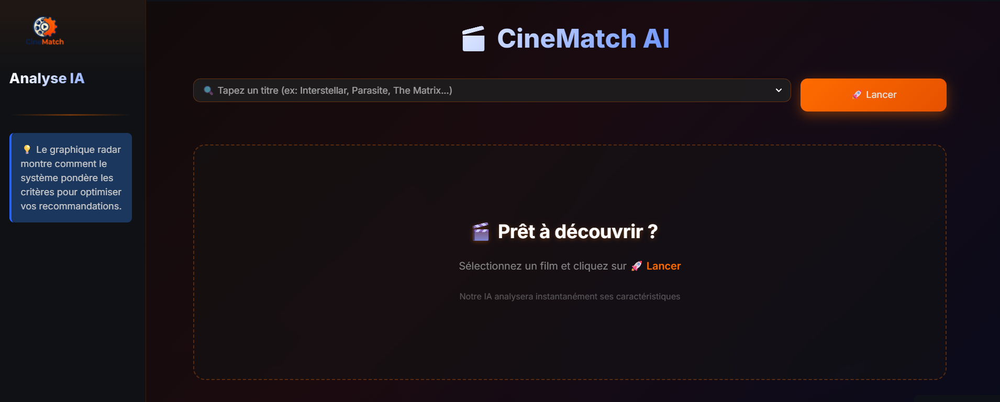
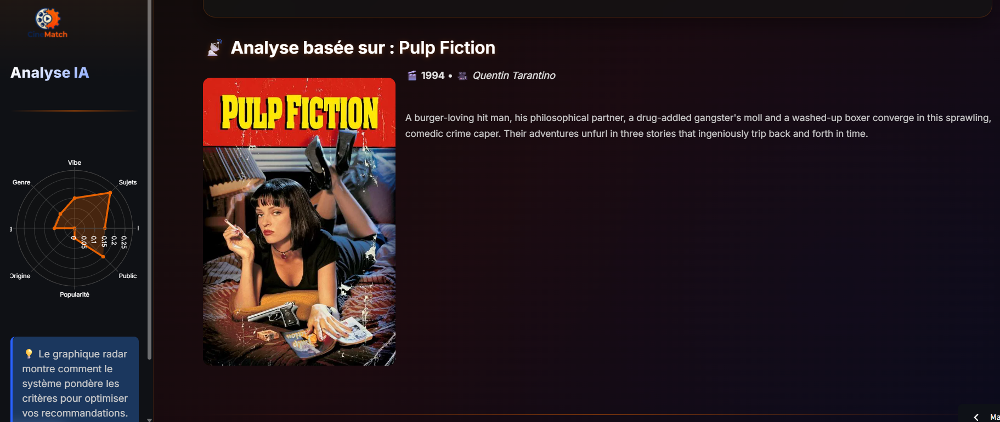
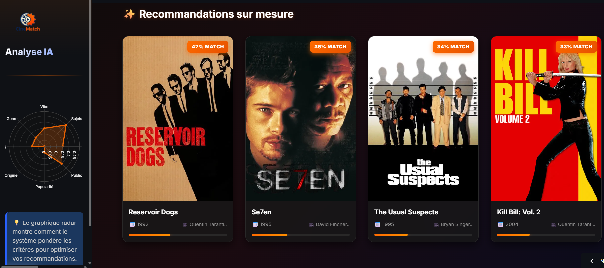

# 🎬 CineMatch AI

### *Next-Gen End-to-End Hybrid Movie Recommendation System*

> **🚀 Live Demo:** [**Launch CineMatch AI**](https://cinematch-reco.streamlit.app/)

---

  
  
  

## 📌 Project Overview

**CineMatch AI** is a full-stack machine learning application designed to overcome the "cold start" and context limitations of traditional keyword filtering. It leverages **State-of-the-Art (SOTA) NLP** to understand the *nuance* of film plots, creating a recommendation engine that feels intuitive and human-like.

**Core Value Proposition:**
* **End-to-End Engineering:** From raw data processing and vector embedding generation to a deployed interactive web application.
* **Hybrid Architecture:** Combines semantic understanding (NLP) with structured metadata (filtering) for robust results.
* **Explainable AI:** Visualizes *why* a movie was recommended via interactive radar charts.

---

## ⚙️ Technical Architecture

This system utilizes a **Weighted Hybrid Approach**, projecting movies into a high-dimensional vector space to calculate similarity.

### 1. Semantic Embedding
* **Model:** `sentence-transformers/all-MiniLM-L6-v2` (SBERT).
* **Function:** Encodes movie plot synopses into dense vector representations.
* **Advantage:** Captures implicit vibes (e.g., "dystopian," "melancholic") even when specific keywords are missing.

### 2. Structured Metadata
* **Features:** One-Hot Encoding of Genres, Cast, Directors, and Keywords (TMDB).
* **Function:** Ensures recommendations align with the user's preferred structural elements (e.g., specific actors or genres).

### 3. The Hybrid Formula
The final similarity score ($S$) is a weighted ensemble of multiple distinct signals:

$$S_{final} = \alpha \cdot S_{semantic} + \beta \cdot S_{metadata} + \gamma \cdot S_{popularity}$$

*Where $\alpha$, $\beta$, and $\gamma$ are dynamic weights tuned for optimal relevance.*

---

##  Key Features

* ** Semantic Search:** Finds movies with similar plotlines and tones using Cosine Similarity on SBERT vectors.
* ** Interactive Visualization:** Dynamic **Plotly Radar Charts** compare the input movie vs. recommendations across varying metrics (Vote Average, Popularity, Release Date).
* ** Modern UI/UX:** Built with **Streamlit**, featuring custom CSS, glassmorphism design, and a responsive layout.
* ** Real-Time Inference:** Pre-computed embedding matrices ensure sub-second query latency.

---

## 🛠️ Tech Stack

| Domain | Technologies |
| :--- | :--- |
| **Language** | Python 3.x |
| **NLP & AI** | Sentence-Transformers (SBERT), HuggingFace, NLTK |
| **Machine Learning** | Scikit-learn (Cosine Similarity), NumPy |
| **Data Engineering** | Pandas, TMDB API (Data Collection) |
| **Frontend / UI** | Streamlit, Custom CSS |
| **Visualization** | Plotly Graph Objects |

---

## 👤 Author

**Victor MICHELON**
*DataScience/IA Engineering student*

